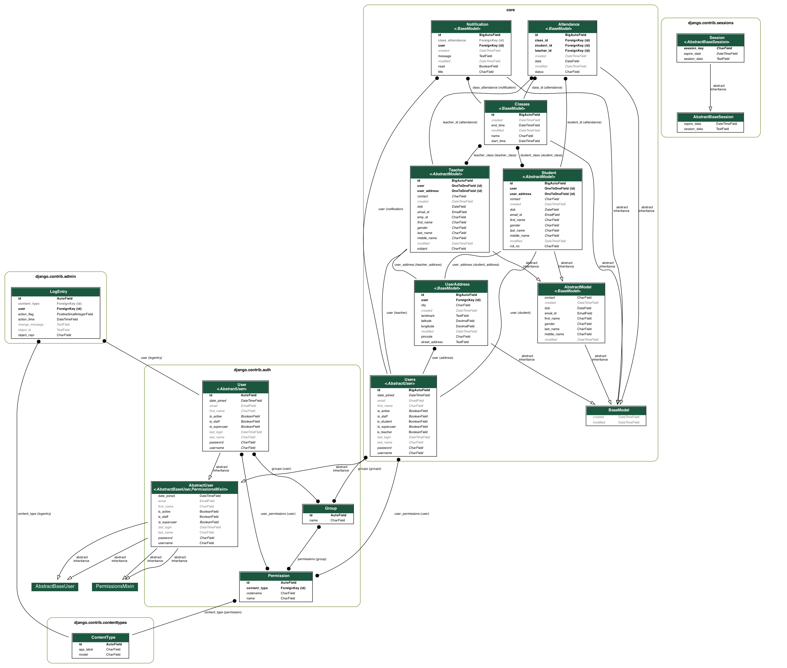

# College Management System

This is a web-based application for managing college-related tasks such as managing teachers, students, classes, and notifications.

## Features

- Add and view Teachers and Students list.
- Add a class for students and assign a teacher for the class.
- List of classes for the day for a student and teacher.
- Notification system for students and teachers for classes.

## Database ER Diagram

## User Roles

There are three types of users in this system:

- Admin: Can manage all aspects of the system.
- Teacher: Can view and manage classes and students assigned to them.
- Student: Can view their own class schedule and receive notifications.

## Testing

This project is implemented using Test-Driven Development (TDD). Tests can be found in the `tests/` directory.

